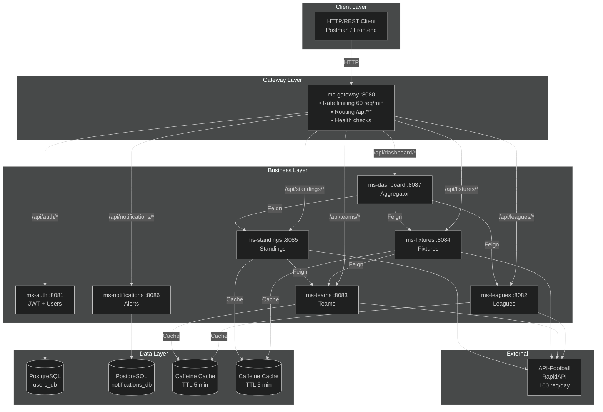

# Container Architecture and Connectivity - SportPulse

This document details the technical configuration of the Docker-based microservices infrastructure, including port mapping, the internal network, and communication dependencies.

## High-Level Microservices Layout

## Network Topology

An internal bridge network named `sportpulse-internal-network` is used.

- **Isolation**: Database services do not expose ports to the host and are accessible only internally.
- **Name Resolution**: Microservices communicate with each other using the service name defined in the orchestration file (example: `http://ms-auth:8081`).

## Service and Port Inventory

| Service                    | External Port | Internal Port | Main Role                                           |
| :------------------------- | :-----------: | :-----------: | :-------------------------------------------------- |
| **ms-gateway**             |     8080      |     8080      | Single entry point, routing, and rate limiting.     |
| **ms-auth**                |     8081      |     8081      | Identity management, login, and JWT token issuance. |
| **ms-leagues**             |     8082      |     8082      | Management of leagues, countries, and seasons.      |
| **ms-teams**               |     8083      |     8083      | Detailed team information and badges.               |
| **ms-fixtures**            |     8084      |     8084      | Fixture schedule and real-time results.             |
| **ms-standings**           |     8085      |     8085      | Standings and season statistics.                    |
| **ms-notifications**       |     8086      |     8086      | Subscription system and event alerts.               |
| **ms-dashboard**           |     8087      |     8087      | Data aggregator for the executive view.             |
| **postgres-auth**          |      N/A      |     5432      | Persistent database for users (PostgreSQL).         |
| **postgres-notifications** |      N/A      |     5432      | Database for subscriptions (PostgreSQL).            |

## Internal Connectivity Matrix

| Source               | Destination            | Connection URL                                                   | Purpose                                  |
| :------------------- | :--------------------- | :--------------------------------------------------------------- | :--------------------------------------- |
| **ms-gateway**       | All                    | `http://ms-<service>:<port>`                                     | Reverse proxy and request routing.       |
| **ms-auth**          | postgres-auth          | `jdbc:postgresql://postgres-auth:5432/auth_db`                   | Credential persistence.                  |
| **ms-fixtures**      | ms-teams               | `http://ms-teams:8083`                                           | Retrieves team information for fixtures. |
| **ms-standings**     | ms-teams               | `http://ms-teams:8083`                                           | Team information for standings tables.   |
| **ms-notifications** | ms-fixtures            | `http://ms-fixtures:8084`                                        | Monitors fixtures to trigger alerts.     |
| **ms-notifications** | postgres-notifications | `jdbc:postgresql://postgres-notifications:5432/notifications_db` | Subscriber registration.                 |
| **ms-dashboard**     | ms-fixtures            | `http://ms-fixtures:8084`                                        | Recent fixture data for the summary.     |
| **ms-dashboard**     | ms-standings           | `http://ms-standings:8085`                                       | Standings data for the summary.          |

## Development Configuration

- **Restart Policy**: `restart: "no"`. Containers do not start automatically to optimize resource usage in the local environment.
- **Health Validation (Healthchecks)**: All microservices implement Spring Boot Actuator.
  - Health endpoint: `/actuator/health`
  - The Gateway has a strict `depends_on` dependency that requires all services to be in a "healthy" state before initialization.

## Critical Environment Variables

- `RAPIDAPI_KEY`: Required so external data services can perform successful queries.
- `JWT_SECRET`: Shared key for signing and validating security tokens between the authentication service and the gateway.

---

_Last updated: April 24, 2026_
